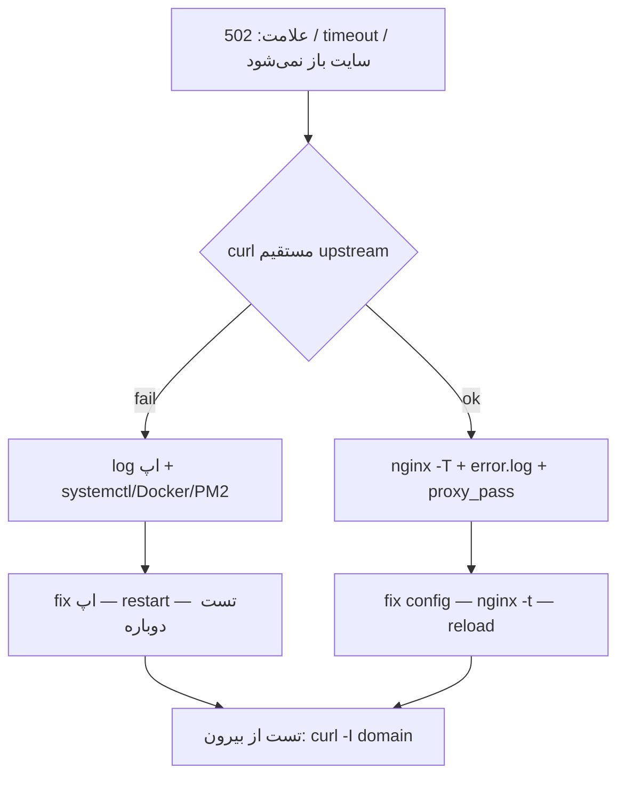

# راهنمای عملیات روزمره: Nginx، Linux و Git

**مرجع فنی برای deploy، debug و همکاری تیمی**

این سند هستهٔ عملی کتاب است: آنچه در کار روزمره — وقتی سرویس down است، 502 می‌گیری، یا `git pull` خطا می‌دهد — واقعاً لازم داری. جزئیات عمیق‌تر در فصل‌های [Nginx](/nginx)، [Linux](/linux) و [Git](/git) و [مرجع دستورات](/commands) گسترش یافته‌اند؛ این صفحه برای **مرور سریع، تصمیم‌گیری و workflow** طراحی شده است.

---

## مخاطب و هدف

| | |
| --- | --- |
| **مخاطب** | توسعه‌دهنده فول‌استک و بک‌اند که deploy، log و Git را خودش انجام می‌دهد |
| **هدف** | مرجع روزانه — نه یک‌بار خواندن و فراموش |
| **نتیجهٔ مطلوب** | خطاهای شبکه را زودتر پیدا کنی، Nginx را با اطمینان reload کنی، مشکل Git را بدون panic حل کنی |

---

## Nginx: دستورات ضروری و مدیریت امن

### دستورات پرتکرار

| دستور | کاربرد |
| --- | --- |
| `sudo nginx -t` | تست syntax قبل از هر تغییر |
| `sudo nginx -T` | نمایش config نهایی merge‌شده — برای debug `location` و `proxy_pass` |
| `sudo systemctl status nginx` | وضعیت سرویس |
| `sudo systemctl reload nginx` | اعمال config بدون قطع connectionهای فعال |
| `sudo systemctl restart nginx` | ری‌استارت کامل — فقط وقتی reload کافی نیست |
| `ps aux \| grep nginx` | master/worker و user اجرا |

**قانون طلایی deploy:**

```bash
sudo nginx -t && sudo systemctl reload nginx
```

اگر `nginx -t` خطا داد، **reload نکن**. config خراب می‌تواند کل سایت را down کند.

### مسیرهای مهم (Ubuntu/Debian)

| مسیر | محتوا |
| --- | --- |
| `/etc/nginx/nginx.conf` | کانفیگ اصلی |
| `/etc/nginx/sites-enabled/` | virtual hostهای فعال |
| `/etc/nginx/snippets/` | تکه‌های مشترک (timeout، header) |
| `/var/log/nginx/access.log` | هر درخواست — status، زمان، URI |
| `/var/log/nginx/error.log` | خطای upstream، permission، SSL |

→ جزئیات: [مرجع · Nginx](/category/مرجع--nginx)

### خواندن log

```bash
# خطاهای زنده
sudo tail -f /var/log/nginx/error.log

# access با فیلتر status
sudo tail -f /var/log/nginx/access.log
sudo grep " 502 " /var/log/nginx/access.log | tail -20

# systemd (اگر از journal استفاده می‌کنی)
sudo journalctl -u nginx -f
```

در access log به **status**، **upstream_status** (اگر در format تعریف کرده‌ای) و **request_time** نگاه کن. error log معمولاً علت دقیق‌تر upstream را می‌گوید: `connect() failed`, `upstream timed out`, `Permission denied`.

---

## Nginx: عیب‌یابی خطاهای HTTP

### جدول سریع

| کد | معمولاً یعنی | اولین اقدام |
| ---: | --- | --- |
| **502** | upstream در دسترس نیست یا crash کرده | `curl` مستقیم به upstream + `error.log` |
| **504** | upstream دیر جواب داد | timeoutها + log اپ + query کند |
| **404** | مسیر، `root` یا `proxy_pass` اشتباه | `nginx -T` + `curl -i` |
| **403** | permission فایل یا index نبود | `ls -la` + user nginx |
| **413** | body بزرگ‌تر از limit | `client_max_body_size` |
| **429** | rate limit | `limit_req` در config |
| **499** | client قطع کرد (معمولاً بی‌ضرر) | timeout سمت client یا load balancer |

→ جزئیات هر کد: [errorهای رایج](/nginx/basics/هفته-اول،-روز-۵-errorهای-رایج)

### 502 — workflow گام‌به‌گام

502 یعنی Nginx به upstream وصل نشده یا response معتبر نگرفته. **قبل از دستکاری config، upstream را جدا تست کن.**

```bash
# 1. اپ واقعاً زنده است؟
curl -v http://127.0.0.1:3000/health

# 2. پورت درست listen می‌کند؟
sudo ss -tulpn | grep 3000
sudo lsof -i :3000

# 3. log Nginx
sudo tail -n 50 /var/log/nginx/error.log

# 4. config نهایی — proxy_pass و upstream
sudo nginx -T | grep -A5 "location /api"
```

دلایل رایج:

- اپ خاموش یا crash (PM2، Docker، systemd)
- `proxy_pass` به port یا host اشتباه
- اپ فقط روی `127.0.0.1` vs `0.0.0.0` — mismatch با Nginx
- Docker: network یا published port اشتباه
- firewall (`ufw`) پورت داخلی را بسته

اگر `curl` مستقیم به upstream **کار نمی‌کند**، مشکل از Nginx نیست — مشکل از اپ یا شبکه است.

### 504 — timeout

```nginx
proxy_connect_timeout 5s;
proxy_send_timeout 60s;
proxy_read_timeout 60s;
```

| Directive | معنی |
| --- | --- |
| `proxy_connect_timeout` | زمان مجاز برای TCP connect به upstream |
| `proxy_send_timeout` | زمان مجاز برای ارسال request |
| `proxy_read_timeout` | زمان مجاز برای انتظار response |

**ریسک:** timeout را بی‌حد بالا بردن فقط 504 را به hang تبدیل می‌کند. علت کندی (DB، external API) را در اپ پیدا کن.

→ [Proxy Error Handling](/nginx/production/روز-۵-Proxy-Error-Handling) · [Timeoutها](/nginx/production/روز-۲-Timeoutهای-مهم)

### 404 و `proxy_pass`

اشتباه slash آخر یکی از پرتکرارترین باگ‌هاست:

```nginx
# location /api/  +  proxy_pass http://backend/   → /api/users → backend/users ✓
# location /api   +  proxy_pass http://backend/   → رفتار متفاوت — حتماً nginx -T بزن
```

→ [نکته proxy_pass](/nginx/basics/نکته-مهم-درباره-proxy_pass)

### Error handling در production

برای API بهتر است JSON کنترل‌شده برگردانی، نه صفحه HTML پیش‌فرض Nginx:

```nginx
location /api/ {
    proxy_pass http://api_backend/;
    proxy_intercept_errors on;
    error_page 502 503 504 = /api-50x.json;
    include snippets/proxy-headers.conf;
}
```

---

## Linux: شبکه، log و پیدا کردن باگ زودتر

### تست شبکه و HTTP

| دستور | کاربرد |
| --- | --- |
| `curl -v http://localhost/api` | verbose — header، redirect، TLS |
| `curl -I https://example.com` | فقط header — cache، status |
| `curl -H "Host: app.local" http://127.0.0.1` | تست virtual host بدون DNS |
| `ss -tulpn` | پورت‌های listening |
| `ss -tan \| grep :443` | connectionهای TCP |
| `sudo lsof -i :80` | چه پروسسی پورت ۸۰ را گرفته |
| `dig example.com` | DNS |
| `ping -c 3 host` | reachability ساده (ICMP ممکن است block باشد) |

```bash
# POST JSON — تست API مستقیم
curl -X POST http://localhost:3000/api/login \
  -H "Content-Type: application/json" \
  -d '{"email":"test@example.com","password":"secret"}'
```

→ [مرجع · شبکه](/commands/linux/network)

### log — جایی که باگ خودش را لو می‌دهد

```bash
# فایل log
tail -f /var/log/nginx/error.log
tail -f /var/log/myapp/app.log

# systemd
sudo journalctl -u nginx -f
sudo journalctl -u my-api -n 100 --since "1 hour ago"

# جستجو در log
grep -i error /var/log/myapp/app.log | tail -50
grep -r "ECONNREFUSED" /var/log/
```

**عادت مفید:** وقتی 502 دیدی، همزمان سه جا را نگاه کن — `error.log` Nginx، log اپ، و `journalctl -u سرویس-اپ`.

### پروسس و سرویس

```bash
ps aux | grep node
sudo systemctl status my-api
sudo systemctl restart my-api   # فقط بعد از فهمیدن علت

top -o %CPU    # یا htop
kill -15 PID   # SIGTERM — ترجیحاً قبل از kill -9
```

→ [خط فرمان Linux](/category/خط-فرمان) · [systemd](/commands/linux/systemd)

### grep برای debug

```bash
grep -rn "proxy_pass" /etc/nginx/
grep -i "upstream" /var/log/nginx/error.log
journalctl -u nginx | grep -i ssl
```

→ [grep](/category/grep) · [ripgrep](/linux/grep/Alternative-ripgrep)

---

## Git: workflow روزمره و حل مشکل

### شروع روز — قبل از کد زدن

```bash
git fetch origin
git status
git log --oneline --graph -10
```

| وضعیت | اقدام |
| --- | --- |
| `Your branch is behind` | `git pull` یا `git pull --rebase` |
| `Your branch is up to date` | مستقیم کار کن |
| `divergent branches` | merge یا rebase — عمداً انتخاب کن (پایین) |
| تغییرات uncommitted | commit، stash، یا discard — قبل از pull |

### دستورات پرتکرار

| دستور | کاربرد |
| --- | --- |
| `git status` | وضعیت فایل‌ها و branch |
| `git diff` / `git diff --staged` | تغییرات |
| `git add . && git commit -m "..."` | commit |
| `git push` | ارسال |
| `git pull --rebase` | دریافت + rebase (branch شخصی) |
| `git pull --ff-only` | فقط اگر fast-forward ممکن باشد |
| `git fetch origin` | دریافت بدون merge |
| `git stash` / `git stash pop` | ذخیره موقت قبل از switch |

→ [مرجع · Git](/category/مرجع--git)

### merge vs rebase — تصمیم سریع

| شرایط | پیشنهاد |
| --- | --- |
| branch شخصی برای PR | `git pull --rebase` روی main — history تمیز |
| branch مشترک تیمی (develop) | merge — history واقعی حفظ شود |
| نمی‌دانی چه شده | `git fetch` + `git log --oneline --graph --all` |

### خطاهای رایج و راه‌حل

#### `divergent branches`

```bash
# rebase (branch شخصی)
git fetch origin
git rebase origin/main

# merge
git pull --no-rebase

# فقط fast-forward — اگر نشد خطا می‌دهد (امن)
git pull --ff-only
```

→ [divergent branches](/git/pull-merge/خطای-divergent-branches-یعنی-چی؟)

#### push بعد از rebase رد شد

```bash
git push --force-with-lease
```

**فقط روی branch شخصی.** هرگز `--force` روی `main`/`master` بدون هماهنگی تیم.

→ [سناریو push بعد از rebase](/git/scenarios/سناریو-push-بعد-از-rebase-reject-میشود)

#### conflict وسط rebase

```bash
# فایل conflict را edit کن، بعد:
git add .
git rebase --continue

# یا لغو کامل:
git rebase --abort
```

→ [conflict وسط rebase](/git/scenarios/سناریو-conflict-وسط-rebase)

#### Detached HEAD

```bash
git switch main          # برگشت به branch
# یا
git switch -c fix-branch # commit موقت را نگه دار
```

→ [HEAD](/category/head)

### ۲۰ سناریوی آماده

وقتی مطمئن نیستی چه کار کنی، [سناریوها](/category/سناریوها) را باز کن — هر کدام یک وضعیت واقعی با دستور دقیق دارد.

---

## Workflow یکپارچه: از خطا تا fix

وقتی کاربر «سایت down است» گفت، این ترتیب را دنبال کن:



**چک‌لیست ۵ دقیقه‌ای:**

1. `curl -I https://your-domain.com` — status چیست؟
2. `curl http://127.0.0.1:PORT/health` — upstream زنده است؟
3. `sudo tail -n 30 /var/log/nginx/error.log`
4. `sudo nginx -t` — config سالم است؟
5. `git status` — deploy اخیر چیزی push نشده که rollback لازم باشد؟

---

## ریسک‌ها، محدودیت‌ها و اشتباهات پرهزینه

| ریسک | چرا مهم است | پیشگیری |
| --- | --- | --- |
| reload بدون `nginx -t` | سایت کامل down | همیشه `nginx -t && reload` |
| `kill -9` روی nginx/worker | connection نیمه‌کاره | `systemctl reload` یا SIGTERM |
| `git push --force` روی main | history تیم خراب | `--force-with-lease` فقط branch شخصی |
| timeout خیلی بلند | hang به جای 504 | fix ریشه در اپ |
| فقط Nginx را مقصر دانستن | ساعت‌ها config اشتباه | همیشه upstream را جدا تست کن |
| log را نخواندن | حدس به جای evidence | `tail -f` قبل از تغییر config |

**محدودیت این سند:** مثال‌ها عمدتاً Ubuntu/Debian، Nginx به‌عنوان reverse proxy، و Git با `origin` روی GitHub/GitLab فرض شده‌اند. Kubernetes ingress، CDN، و multi-region خارج از scope این صفحه هستند — برای آن‌ها به مستندات پلتفرم مراجعه کن.

---

## جمع‌بندی و گام بعدی

این کتاب سه مهارت را به هم وصل می‌کند:

1. **Nginx** — درخواست را درست route کن، خطا را readable کن، deploy را safe کن.
2. **Linux** — با `curl`، `ss` و log بفهم مشکل کجاست — نه حدس بزن.
3. **Git** — pull/push/rebase را با آگاهی انتخاب کن تا conflict و force-push اضطراری کم شود.

### مسیر پیشنهادی مطالعه

| اگر… | برو به… |
| --- | --- |
| تازه Nginx شروع کردی | [فصل ۱ · پایه عملی](/category/فصل-۱--پایه-عملی) |
| روی production کار می‌کنی | [فصل ۲ · Production](/category/فصل-۲--production) |
| 502/504 مکرر و latency | [فصل ۳ · شبکه و OS](/category/فصل-۳--شبکه-و-os) |
| روی سرور تازه‌واری | [Linux · خط فرمان](/category/خط-فرمان) |
| Git گیر کرد | [سناریوها](/category/سناریوها) |
| فقط دستور می‌خواهی | [مرجع دستورات](/commands) |

### عادت روزانه (۲ دقیقه)

```text
git fetch && git status
→ قبل از deploy: nginx -t
→ بعد از deploy: curl -I + tail error.log
```

> **روش یادگیری این کتاب:** بخوان ← کانفیگ کن ← عمداً خراب کن ← log ببین ← توضیح بده ← درست کن

---

## فرضیات

| # | فرض |
| --- | --- |
| 1 | OS سرور: Linux (Ubuntu/Debian) با systemd |
| 2 | Nginx به‌عنوان reverse proxy جلوی اپ (Node، Python، Go و …) |
| 3 | remote Git: `origin` روی GitHub/GitLab؛ branch اصلی `main` (یا `master`) |
| 4 | دسترسی SSH به سرور برای log و reload |
| 5 | TLS با Let's Encrypt یا certificate موجود — جزئیات SSL در فصل Production |
| 6 | reader با مفاهیم پایه HTTP و JSON آشناست |

اگر محیطت متفاوت است (Alpine، Docker-only بدون systemd، monorepo با چند remote)، دستورات را adapt کن؛ **workflow** (تست upstream → log → config → reload) ثابت می‌ماند.
